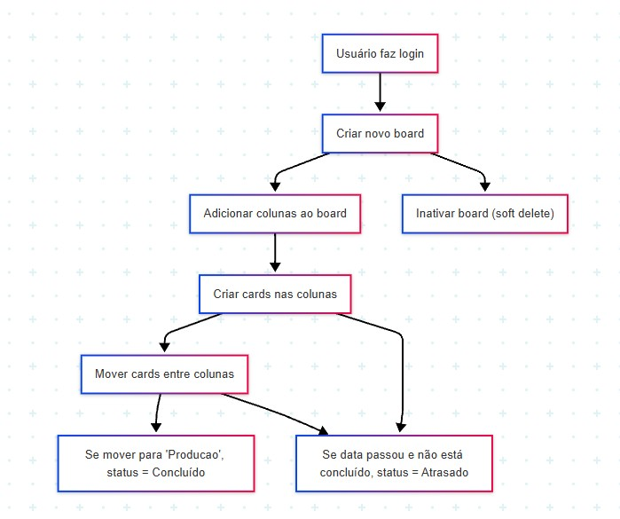

# Board Management Project

This is a board management project that allows you to create, view, and manage kanban boards efficiently. The project is built using React and Next.js, with backend Django integration for data persistence.

## Features & Business Rules

- **User Authentication:** Only authenticated users can access and manage their boards, columns, and cards.
- **Board Management:** Create, view, inactivate, and list your own boards.
- **Column Management:** Add, rename, and reorder columns within a board. Drag-and-drop supported.
- **Card Management:**  
  - Add, edit, move, and reorder cards within columns.
  - Cards have a title, delivery date, status, assignee, and order.
  - Cards moved to the "Produção" column are automatically marked as "Concluído" and become locked for further edits or moves.
  - Cards with delivery dates in the past and not marked as "Concluído" are shown as "Atrasado".
- **Soft Delete for Boards:** Inactivating a board hides it from the main list but preserves its data.
- **Real-time UI Updates:** Drag-and-drop actions update the UI and persist changes to the backend.
- **Visual Feedback:** Toast notifications for success and error actions.

## Example Usage & System Flow



1. **User logs in** with their credentials.
2. **User creates a new board** (e.g., "Projeto X").
3. **User adds columns** (e.g., "Backlog", "Em andamento", "Produção").
4. **User creates cards** in columns, specifying title and delivery date.
5. **User drags cards** between columns or reorders them within a column.
6. **If a card is moved to "Produção"**, it is marked as "Concluído" and locked.
7. **If a card's delivery date passes and it is not done**, it is shown as "Atrasado".
8. **User can inactivate a board**, which hides it from the main list.

## How to Run the Project

### Prerequisites

- Node.js installed on your machine
- npm or yarn package manager

### Steps to Run

1. **Clone the Repository**

   ```bash
   git clone https://github.com/GabrielDalacorte/afl-kanban-web.git
   ```

2. **Install Dependencies**

   ```bash
   cd your-repository
   npm install
   ```
   or
   ```bash
   yarn install
   ```

3. **Environment Configuration**

   Create a `.env` file in the root of the project and add:

   ```env
   NEXT_PUBLIC_BACKEND_URL=http://localhost:8000
   ```

4. **Run the Project**

   ```bash
   npm run dev
   ```
   or
   ```bash
   yarn dev
   ```

5. **Access the Project**

   Open your browser and go to `http://localhost:3000` to view the project running.

## Project Structure

- **Components:** Located in the `app/_components` folder, where modal components and other reusable elements are found.
- **Services:** Located in the `app/services` folder, where functions for local storage interaction and backend communication are defined.
- **Configuration:** `next.config.ts` file for specific Next.js configurations.

## Contribution

Feel free to contribute to the project or open issues to report problems.


